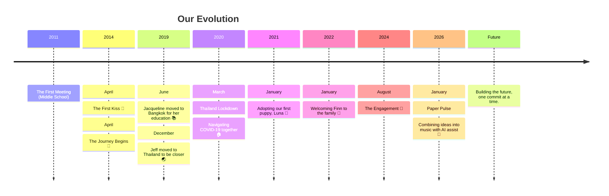

# Our Journey Begins...

For years, our love story unfolded quietly, a cherished bond known to our immediate families and, most importantly, to the two of us. Today, with full hearts, we are thrilled to share it more widely with the world.

It all started in middle school around 2011, where Laurensius Jeffrey Chandra (Skiddle) and Jacqueline Patravee (Scarletnine) first met. Though high school took us on different paths, our connection remained, and on April 14, 2014, we took the step to build something serious together.

---

### 🗓️ Milestones & Timeline

| Date | Event |
| :--- | :--- |
| 2011 | The First Meeting (Middle School) |
| 2014-04-12 | The First Kiss 💋 |
| 2014-04-14 | The Journey Begins 🥂 |
| 2019-06-01 | Jacqueline moved to Bangkok for her education 📚 |
| 2019-12-01 | Jeff moved to Thailand to be closer 🌏 |
| 2020-03-01 | Thailand Lockdown: Navigating COVID-19 together 🏠 |
| 2021-01-01 | Adopting our first puppy, Luna 🐶 |
| 2022-01-01 | Welcoming Finn to the family 🐾 |
| 2024-08-04 | The Engagement 💍 |
| 2026-01-11 | Paper Pulse: Combining ideas into music with AI assist 🎵 |
| Future | Building the future, one commit at a time. |

### 🎨 Paper Pulse
In January 11, 2026, we joined forces to create **Paper Pulse**—a journey of combining our ideas into music using AI assistance, alongside our shared focus on privacy, design, and software.

#### 🧔 Jeff
Developer with diverse knowledge of AI, Code, and Logic. Passionate about building secure, user-centric software and exploring the intersection of technology and privacy.
   
* [**Jeff's Blog**](https://skiddle.id)

#### 👩‍🎨 Jacqueline
Designer, Writer, and PR. Focused on crafting beautiful digital experiences, storytelling, and minimalist designs.
   
* [**Jacqueline's Blog**](https://scarletnine.dev)

---

### 🕒 The Counter
**We have been together for 11 years, 11 months, 11 days.** Next Anniversary Progress:
`██████████████████░░ 94.5%`

**Current Stats:**
 

*Last Updated: 2026-03-25 UTC*
